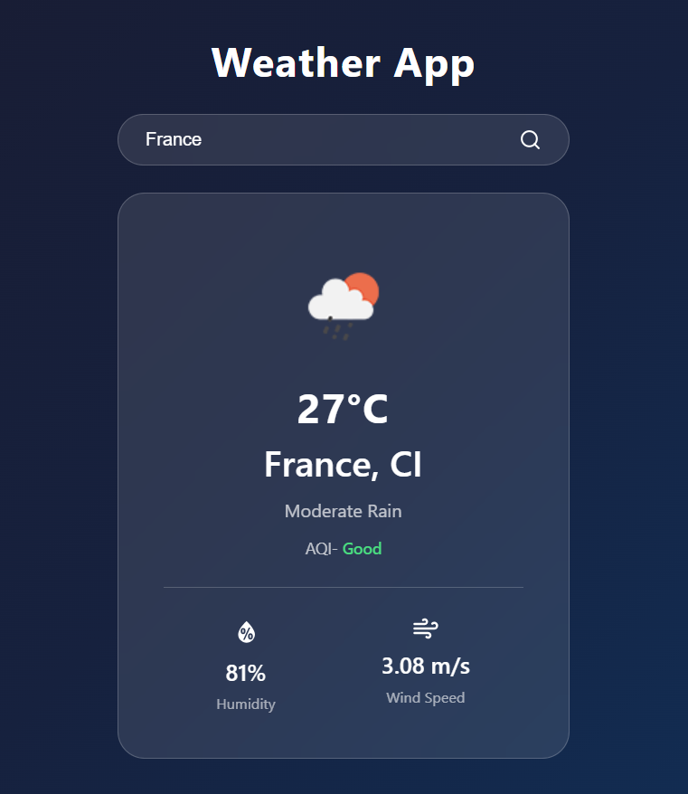
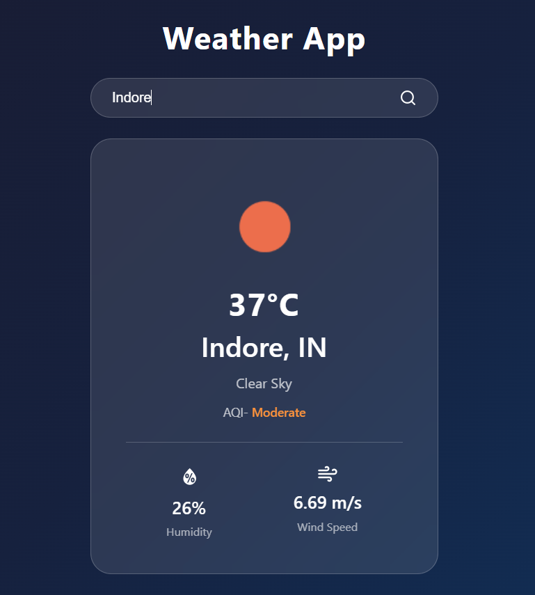

# Weatherly 🌤️

A real-time weather application built with React and the OpenWeatherMap API.

## Features
- Search weather by city name
- Displays temperature, condition, humidity, wind speed
- Air Quality Index (AQI) with labels
- Dynamic weather icons
- Error handling for invalid cities
- Responsive design for all screen sizes

## Tech Stack
- React (Vite)
- OpenWeatherMap API
- React Icons
- CSS3

## Screenshots



## Setup

1. Clone the repository
```bash
git clone https://github.com/purvanshi0819/Weatherly.git
```

2. Install dependencies
```bash
npm install
```

3. Create a `.env` file in the root directory
```
VITE_WEATHER_API_KEY=your_api_key_here
```

4. Run the app
```bash
npm run dev
```
